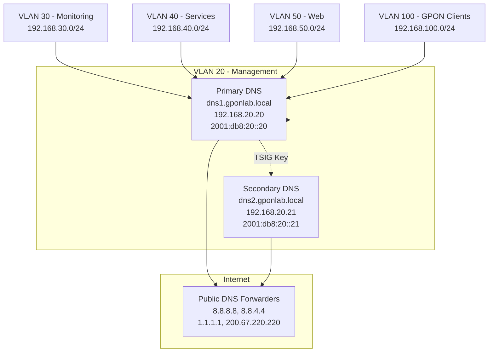
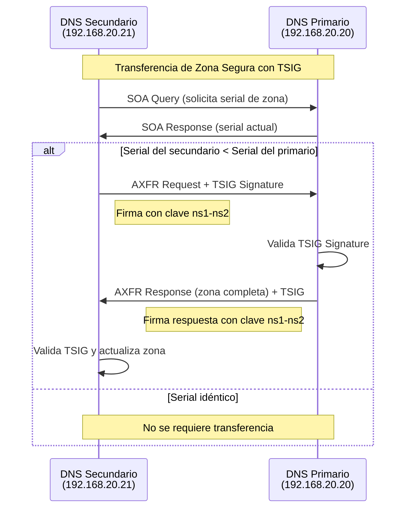
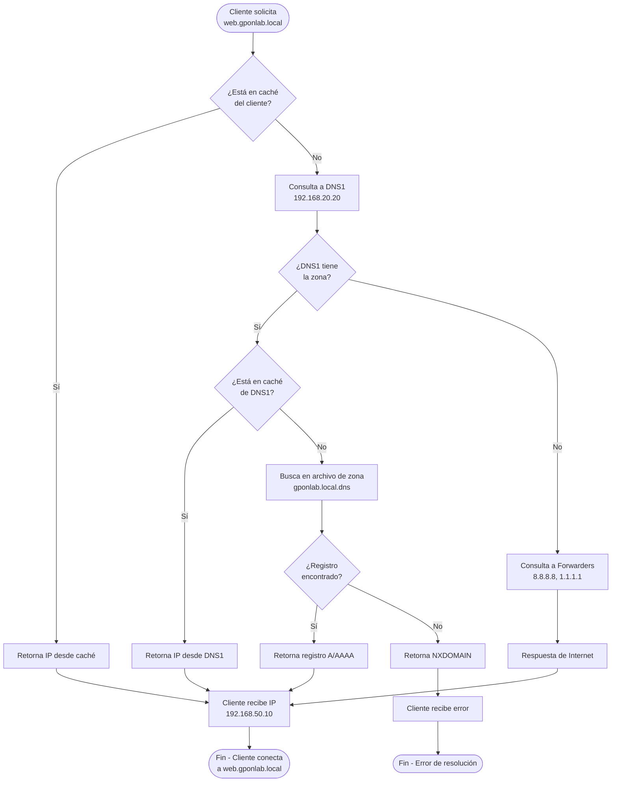
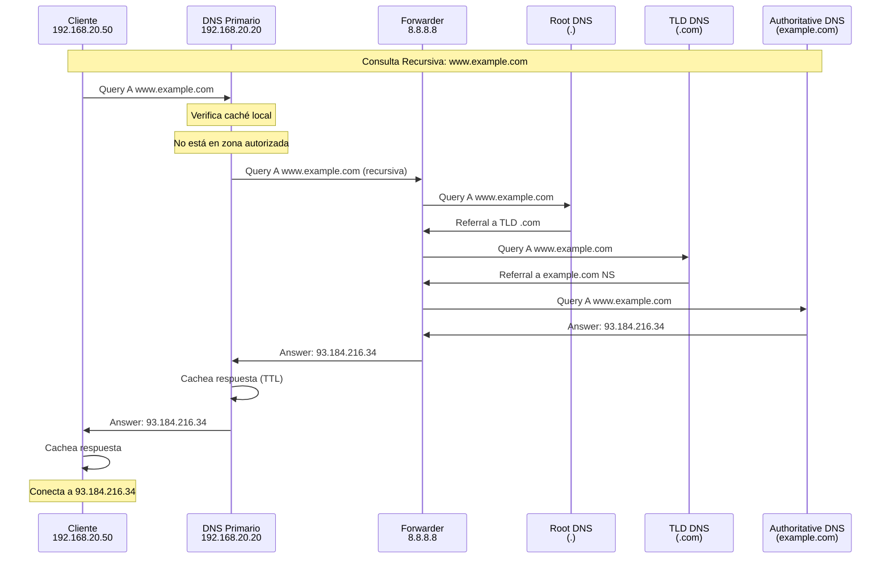
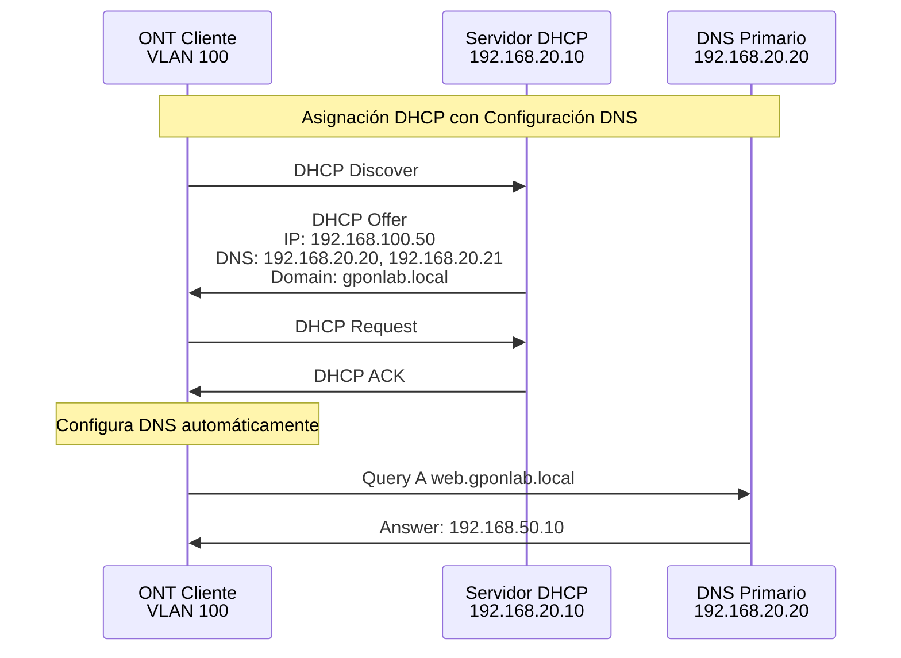
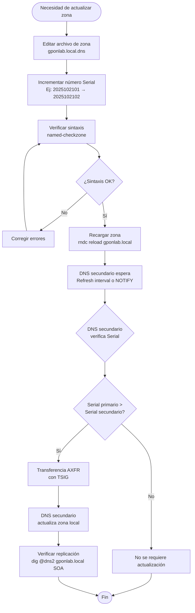

# Infraestructura Red GPON - SERVICIO DNS
## Implementación DNS con BIND9

---

## Descripción General del Servicio DNS

El servicio DNS (Domain Name System) implementado en el proyecto de red GPON utiliza
BIND9 sobre Ubuntu Server y proporciona resolución de nombres para todos los 
servicios internos de la infraestructura. El sistema está configurado con arquitectura 
maestro-esclavo, soporte dual stack (IPv4/IPv6), zonas inversas completas, seguridad 
mediante TSIG y capacidades de DNS64 para interoperabilidad entre redes IPv4 e IPv6.

---

## Arquitectura del Sistema DNS



---

## Tabla de Direccionamiento DNS

| Servicio | Hostname | IPv4 | IPv6 | VLAN |
|----------|----------|------|------|------|
| DNS Primario | dns1.gponlab.local | 192.168.20.20 | 2001:db8:20::20 | 20 |
| DNS Secundario | dns2.gponlab.local | 192.168.20.21 | 2001:db8:20::21 | 20 |
| DHCP Server | dhcp.gponlab.local | 192.168.20.10 | 2001:db8:20::10 | 20 |
| RADIUS Server | radius.gponlab.local | 192.168.20.30 | 2001:db8:20::30 | 20 |
| QoS Server | qos.gponlab.local | 192.168.20.20 | 2001:db8:20::20 | 20 |
| NTP Server | ntp.gponlab.local | 192.168.40.30 | 2001:db8:40::30 | 40 |
| NAT Server | nat.gponlab.local | 192.168.40.10 | 2001:db8:40::10 | 40 |
| LibreNMS | librenms.gponlab.local | 192.168.30.10 | 2001:db8:30::10 | 30 |
| Metrics | metrics.gponlab.local | 192.168.30.20 | 2001:db8:30::20 | 30 |
| Web Server | web.gponlab.local | 192.168.50.10 | 2001:db8:50::10 | 50 |
| Load Balancer | lb.gponlab.local | 192.168.50.20 | 2001:db8:50::20 | 50 |
| Clientes GPON | clientes-gpon.gponlab.local | 192.168.100.1 | 2001:db8:100::1 | 100 |

---

## Configuración del Archivo `named.conf.options`

Este archivo contiene las opciones globales del servidor DNS BIND9, incluyendo 
configuración de escucha, recursión, forwarders, ACLs y DNS64.

### Configuración

```cfg
options {
    directory "/var/cache/bind";

    forwarders {
        8.8.8.8;
        8.8.4.4;
        1.1.1.1;
        200.67.220.220;
    };

    dnssec-validation auto;

    listen-on port 53 { 192.168.20.20; 127.0.0.1; };
    listen-on-v6 port 53 { 2001:db8:20::20; ::1; };

    recursion yes;
    allow-recursion { trusted-hosts; };
    allow-query { trusted-hosts; };
    allow-transfer { secondary-servers; };

    dns64 64:ff9b::/96 {
        clients { any; };
        mapped { any; };
        exclude { 0::/3; 2001:db8::/32; };
        break-dnssec yes;
    };
};

acl "trusted-hosts" {
    localhost;
    localnets;
    192.168.20.0/24;
    2001:db8:20::/64;
};

acl "secondary-servers" {
    192.168.20.21;
};
```

### Tabla de Parámetros

| Parámetro | Valor | Descripción |
|-----------|-------|-------------|
| directory | /var/cache/bind | Directorio de trabajo para archivos temporales y caché |
| forwarders | 8.8.8.8, 8.8.4.4, 1.1.1.1, 200.67.220.220 | Servidores DNS externos para consultas recursivas de dominios no autorizados |
| dnssec-validation | auto | Validación automática de DNSSEC para respuestas DNS |
| listen-on port 53 | 192.168.20.20, 127.0.0.1 | Interfaces IPv4 donde el servidor DNS escucha peticiones |
| listen-on-v6 port 53 | 2001:db8:20::20, ::1 | Interfaces IPv6 donde el servidor DNS escucha peticiones |
| recursion | yes | Habilita consultas recursivas para resolver nombres externos |
| allow-recursion | trusted-hosts | ACL que define qué clientes pueden realizar consultas recursivas |
| allow-query | trusted-hosts | ACL que define qué clientes pueden realizar consultas DNS |
| allow-transfer | secondary-servers | ACL que define qué servidores pueden realizar transferencias de zona |
| dns64 | 64:ff9b::/96 | Habilita traducción DNS64 para clientes IPv6 que acceden a recursos IPv4 |

### Forwarders

Los **forwarders** son servidores DNS externos utilizados cuando el servidor DNS local no 
puede resolver un nombre de dominio de su zona autorizada. La configuración incluye:

- **8.8.8.8 / 8.8.4.4**: Google Public DNS - Disponibilidad y rendimiento global
- **1.1.1.1**: Cloudflare DNS - Enfoque en privacidad y velocidad
- **200.67.220.220**: DNS - 

### Explicación de ACLs (Access Control Lists)

**ACL trusted-hosts**: Define los hosts confiables que pueden realizar consultas al DNS.
Incluye:
- localhost: El propio servidor DNS
- localnets: Todas las redes directamente conectadas
- 192.168.20.0/24: Red de gestión VLAN 20 (IPv4)
- 2001:db8:20::/64: Red de gestión VLAN 20 (IPv6)

**ACL secondary-servers**: Define los servidores DNS secundarios autorizados para replicación 
de zonas mediante transferencias AXFR/IXFR.
- 192.168.20.21: DNS secundario (dns2.gponlab.local)

### DNS64 

DNS64 es una tecnología de transición IPv6 que permite a clientes IPv6-only acceder a 
recursos IPv4-only mediante síntesis de registros AAAA desde registros A.

**Parámetros DNS64**:
- **Prefijo 64:ff9b::/96**: Prefijo estándar definido en RFC 6052 para traducción NAT64/DNS64
- **clients { any; }**: Cualquier cliente puede usar la funcionalidad DNS64
- **mapped { any; }**: Cualquier dirección IPv4 puede ser mapeada
- **exclude**: Excluye ciertos prefijos de la síntesis (documentación y redes locales)
- **break-dnssec yes**: Permite DNS64 aunque rompa validación DNSSEC (necesario para síntesis)

---

## Configuración del Archivo named.conf.local

### Descripción General
Este archivo define las zonas DNS autorizadas que el servidor gestiona, incluyendo 
zonas directas (forward) e inversas (reverse) tanto para IPv4 como IPv6.

### Configuración

```cfg
zone "gponlab.local" {
    type master;
    file "/etc/bind/gponlab.local.dns";
};

zone "20.168.192.in-addr.arpa" {
    type master;
    file "/etc/bind/20.168.192.in-addr.arpa.dns";
};

zone "0.2.0.0.8.b.d.0.1.0.0.2.ip6.arpa" {
    type master;
    file "/etc/bind/0.2.0.0.8.b.d.0.1.0.0.2.ip6.arpa.dns";
};

key "ns1-ns2" {
    algorithm hmac-sha256;
    secret "ZlZTQ2NsebXm1D7u5juta3GcuwG/H/y3c3MqwuCbPkU=";
};
```

### Tabla de Zonas Configuradas

| Zona | Tipo | Función | Archivo |
|------|------|---------|---------|
| gponlab.local | Directa (Forward) | Resolución nombre → IP | gponlab.local.dns |
| 20.168.192.in-addr.arpa | Inversa IPv4 (Reverse) | Resolución IP → nombre (192.168.20.0/24) | 20.168.192.in-addr.arpa.dns |
| 0.2.0.0.8.b.d.0.1.0.0.2.ip6.arpa | Inversa IPv6 (Reverse) | Resolución IP → nombre (2001:db8:20::/64) | 0.2.0.0.8.b.d.0.1.0.0.2.ip6.arpa.dns |

### Explicación de Zona Directa (Forward Zone)

La zona **gponlab.local** es la zona directa principal del dominio. Permite resolver 
nombres de host a direcciones IP (tanto IPv4 como IPv6). Es la zona donde se definen 
todos los servicios de la infraestructura GPON.

### Explicación de Zona Inversa IPv4

La zona **20.168.192.in-addr.arpa** permite la resolución inversa de la red 192.168.20.0/24.
El formato de zona inversa IPv4 invierte los octetos de la dirección IP:
- Red: 192.168.20.0/24
- Zona inversa: 20.168.192.in-addr.arpa

Ejemplo: La IP 192.168.20.20 se resuelve con el registro PTR "20" en esta zona.

### Explicación de Zona Inversa IPv6

La zona **0.2.0.0.8.b.d.0.1.0.0.2.ip6.arpa** permite la resolución inversa de la red 
2001:db8:20::/64. El formato de zona inversa IPv6 invierte cada nibble (4 bits) de 
la dirección expandida:

- Red: 2001:db8:20::/64
- Expandida: 2001:0db8:0020:0000::/64
- Zona inversa: 0.2.0.0.8.b.d.0.1.0.0.2.ip6.arpa

Ejemplo: La IP 2001:db8:20::20 se resuelve con el registro PTR 
"0.2.0.0.0.0.0.0.0.0.0.0.0.0.0.0.0.0.0.0.0.2.0.0.8.b.d.0.1.0.0.2.ip6.arpa"

### TSIG Key (Transaction Signature)

La clave TSIG **ns1-ns2** proporciona autenticación criptográfica para transferencias de 
zona entre el DNS primario y secundario.

**Parámetros TSIG**:
- **algorithm**: hmac-sha256 - Algoritmo de hash criptográfico
- **secret**: Clave secreta compartida entre servidores primario y secundario
- **Función**: Previene transferencias de zona no autorizadas y ataques de suplantación



---

## Configuración de Zona Directa `gponlab.local.dns`

### Descripción General
Archivo de zona directa que contiene todos los registros de recursos (RR) para el 
dominio gponlab.local, incluyendo registros SOA, NS, A, AAAA y CNAME.

### Configuración

```cfg
$TTL 604800
@   IN  SOA dns1.gponlab.local. admin.gponlab.local. (
        2025102101  ; Serial
        86400       ; Refresh
        7200        ; Retry
        3600000     ; Expire
        604800 )    ; Minimum
@   IN  NS  dns1.gponlab.local.
@   IN  NS  dns2.gponlab.local.

dns1    IN  A     192.168.20.20
dns2    IN  A     192.168.20.21

dns1    IN  AAAA  2001:db8:20::20
dns2    IN  AAAA  2001:db8:20::21

dhcp    IN  A     192.168.20.10
dhcp    IN  AAAA  2001:db8:20::10

radius  IN  A     192.168.20.30
radius  IN  AAAA  2001:db8:20::30

qos     IN  A     192.168.20.20
qos     IN  AAAA  2001:db8:20::20

ntp     IN  A     192.168.40.30
ntp     IN  AAAA  2001:db8:40::30

nat     IN  A     192.168.40.10
nat     IN  AAAA  2001:db8:40::10

librenms IN  A     192.168.30.10
librenms IN  AAAA  2001:db8:30::10

metrics IN  A     192.168.30.20
metrics IN  AAAA  2001:db8:30::20

web     IN  A     192.168.50.10
web     IN  AAAA  2001:db8:50::10

lb      IN  A     192.168.50.20
lb      IN  AAAA  2001:db8:50::20

www     IN  CNAME web.gponlab.local.

clientes-gpon IN A     192.168.100.1
clientes-gpon IN AAAA  2001:db8:100::1
```

### Registro SOA (Start of Authority)

El registro SOA define parámetros administrativos de la zona.

| Parámetro | Valor | Descripción |
|-----------|-------|-------------|
| MNAME | dns1.gponlab.local. | Servidor DNS primario (maestro) de la zona |
| RNAME | admin.gponlab.local. | Correo del administrador (admin@gponlab.local) |
| Serial | 2025102101 | Número de serie de la zona (formato YYYYMMDDnn) |
| Refresh | 86400 (24 horas) | Intervalo en que el secundario verifica cambios |
| Retry | 7200 (2 horas) | Intervalo de reintento si falla refresh |
| Expire | 3600000 (~41 días) | Tiempo tras el cual el secundario descarta la zona si no puede contactar al primario |
| Minimum TTL | 604800 (7 días) | TTL mínimo para respuestas negativas (NXDOMAIN) |

**Serial**: El formato 2025102101 representa:
- 2025: Año
- 10: Mes (octubre)
- 21: Día
- 01: Número de revisión del día

El serial debe incrementarse cada vez que se modifica la zona para que los servidores 
secundarios detecten cambios.

### Explicación del Registro NS (Name Server)

Los registros NS especifican los servidores autorizados para la zona:
- dns1.gponlab.local (primario)
- dns2.gponlab.local (secundario)

Ambos servidores NS deben tener registros A y AAAA correspondientes en la zona.

### Explicación de Registros A y AAAA

**Registro A (Address)**: Mapea un nombre de host a una dirección IPv4.
Ejemplo: `dns1 IN A 192.168.20.20`

**Registro AAAA (IPv6 Address)**: Mapea un nombre de host a una dirección IPv6.
Ejemplo: `dns1 IN AAAA 2001:db8:20::20`

Todos los servicios tienen configuración dual-stack (tanto A como AAAA) para 
compatibilidad completa IPv4/IPv6.

### Explicación de Registro CNAME (Canonical Name)

El registro CNAME crea un alias de un nombre a otro nombre canónico.

```
www IN CNAME web.gponlab.local.
```

Esto significa que `www.gponlab.local` es un alias de `web.gponlab.local`. Las consultas 
a www.gponlab.local se resuelven finalmente a las direcciones IP de web.gponlab.local.

**Importante**: Un registro CNAME no puede coexistir con otros tipos de registros para 
el mismo nombre (excepto DNSSEC).

### TTL (Time To Live)

El valor `$TTL 604800` (7 días) define cuánto tiempo los resolvers pueden cachear los 
registros de esta zona antes de requerir una nueva consulta al servidor autoritativo.

---

## Configuración de Zona Inversa IPv4 `20.168.192.in-addr.arpa.dns`

Archivo de zona inversa para la red 192.168.20.0/24 que permite resolución PTR 
(IP a nombre).

### Configuración

```cfg
$TTL 604800
@   IN  SOA dns1.gponlab.local. admin.gponlab.local. (
        2025102101
        86400
        7200
        3600000
        604800 )
@   IN  NS  dns1.gponlab.local.
@   IN  NS  dns2.gponlab.local.

20  IN  PTR dns1.gponlab.local.
21  IN  PTR dns2.gponlab.local.
10  IN  PTR dhcp.gponlab.local.
30  IN  PTR radius.gponlab.local.
100 IN  PTR clientes-gpon.gponlab.local.
```

### Explicación de Registros PTR

Los registros PTR (Pointer) proporcionan resolución inversa de IP a nombre.

| Registro | IP Completa | Nombre |
|----------|-------------|--------|
| 20 | 192.168.20.20 | dns1.gponlab.local. |
| 21 | 192.168.20.21 | dns2.gponlab.local. |
| 10 | 192.168.20.10 | dhcp.gponlab.local. |
| 30 | 192.168.20.30 | radius.gponlab.local. |
| 100 | 192.168.20.100 | clientes-gpon.gponlab.local. |

### Importancia de la Resolución Inversa

La resolución inversa es necesaria para:
- **Verificación de identidad**: Muchos servicios (SMTP, SSH) verifican que la IP tenga PTR válido
- **Logging y auditoría**: Logs más legibles con nombres en lugar de IPs
- **Troubleshooting**: Facilita la identificación de dispositivos en la red
- **Cumplimiento**: Algunos estándares de seguridad requieren resolución inversa

---

## Configuración de Zona Inversa IPv6: 0.2.0.0.8.b.d.0.1.0.0.2.ip6.arpa.dns

### Descripción General
Archivo de zona inversa para la red 2001:db8:20::/64 que permite resolución PTR IPv6.

### Configuración

```cfg
$TTL 604800
@   IN  SOA dns1.gponlab.local. admin.gponlab.local. (
        2025102101
        86400
        7200
        3600000
        604800 )
@   IN  NS  dns1.gponlab.local.
@   IN  NS  dns2.gponlab.local.

0.2.0.0.0.0.0.0.0.0.0.0.0.0.0.0.0.2.0.0.8.b.d.0.1.0.0.2.ip6.arpa. IN PTR dns1.gponlab.local.
1.0.2.0.0.0.0.0.0.0.0.0.0.0.0.0.0.2.0.0.8.b.d.0.1.0.0.2.ip6.arpa. IN PTR dns2.gponlab.local.
2.0.2.0.0.0.0.0.0.0.0.0.0.0.0.0.0.2.0.0.8.b.d.0.1.0.0.2.ip6.arpa. IN PTR dhcp.gponlab.local.
3.0.2.0.0.0.0.0.0.0.0.0.0.0.0.0.0.2.0.0.8.b.d.0.1.0.0.2.ip6.arpa. IN PTR radius.gponlab.local.
```

### Formato de Zona Inversa IPv6

La zona inversa IPv6 utiliza notación nibble reversa (cada dígito hexadecimal invertido 
con puntos).

**Ejemplo de conversión**:
- Dirección IPv6: 2001:db8:20::20
- Expansión completa: 2001:0db8:0020:0000:0000:0000:0000:0020
- Reversa nibble: 0.2.0.0.0.0.0.0.0.0.0.0.0.0.0.0.0.0.0.0.0.2.0.0.8.b.d.0.1.0.0.2.ip6.arpa.

### Tabla de Registros PTR IPv6

| IP IPv6 (abreviada) | IP IPv6 (expandida) | Registro PTR (forma corta) | Nombre |
|---------------------|---------------------|----------------------------|--------|
| 2001:db8:20::20 | 2001:0db8:0020:0000::0020 | 0.2.0.0... | dns1.gponlab.local. |
| 2001:db8:20::21 | 2001:0db8:0020:0000::0021 | 1.0.2.0... | dns2.gponlab.local. |
| 2001:db8:20::10 | 2001:0db8:0020:0000::0010 | 2.0.2.0... | dhcp.gponlab.local. |
| 2001:db8:20::30 | 2001:0db8:0020:0000::0030 | 3.0.2.0... | radius.gponlab.local. |

---

## Diagrama de Resolución DNS



---

## Proceso de Consulta DNS Recursiva



---

## Integración DNS con Otros Servicios del Proyecto

### Integración con DHCP

El servidor DHCP (192.168.20.10) proporciona configuración automática de DNS a los 
clientes GPON en VLAN 100.

**Opciones DHCP relevantes**:
- Option 6 (DNS Servers): 192.168.20.20, 192.168.20.21
- Option 15 (Domain Name): gponlab.local
- Option 119 (Domain Search): gponlab.local



### Integración con RADIUS

FreeRADIUS utiliza resolución DNS para:
- Identificar clientes NAS (Network Access Server) por hostname
- Logging con nombres en lugar de IPs
- Configuración de realms basados en dominios

### Integración con LibreNMS y Metrics

Los sistemas de monitoreo utilizan DNS para:
- **Descubrimiento de dispositivos**: Resolución de nombres de equipos de red
- **Alertas**: Identificación clara de dispositivos en notificaciones
- **Gráficos**: Etiquetado de métricas con nombres FQDN

### Integración con Servicios Web

El servidor web y load balancer utilizan DNS para:
- **Virtual Hosts**: Configuración de sitios basados en nombre
- **SSL/TLS**: Certificados asociados a nombres de dominio
- **Acceso de usuarios**: URLs amigables (www.gponlab.local)

---

## TSIG (Transaction Signature)

TSIG proporciona autenticación criptográfica para transacciones DNS entre servidores 
de confianza, especialmente para transferencias de zona.

### Generación de Clave TSIG

```bash
tsig-keygen ns1-ns2
```

**Salida**:
```cfg
key "ns1-ns2" {
    algorithm hmac-sha256;
    secret "ZlZTQ2NsebXm1D7u5juta3GcuwG/H/y3c3MqwuCbPkU=";
};
```

### Configuración en DNS Primario

En `/etc/bind/named.conf.local`:
```cfg
key "ns1-ns2" {
    algorithm hmac-sha256;
    secret "ZlZTQ2NsebXm1D7u5juta3GcuwG/H/y3c3MqwuCbPkU=";
};

server 192.168.20.21 {
    keys { ns1-ns2; };
};
```

En `/etc/bind/named.conf.options`:
```cfg
acl "secondary-servers" {
    192.168.20.21;
};

options {
    allow-transfer { key ns1-ns2; };
}
```

### Configuración en DNS Secundario

En `/etc/bind/named.conf.local`:
```cfg
key "ns1-ns2" {
    algorithm hmac-sha256;
    secret "ZlZTQ2NsebXm1D7u5juta3GcuwG/H/y3c3MqwuCbPkU=";
};

server 192.168.20.20 {
    keys { ns1-ns2; };
};

zone "gponlab.local" {
    type slave;
    masters { 192.168.20.20 key ns1-ns2; };
    file "/var/cache/bind/gponlab.local.dns";
};
```

### Algoritmos TSIG Disponibles

| Algoritmo | Longitud de Clave | Seguridad | Uso Recomendado |
|-----------|-------------------|-----------|-----------------|
| hmac-md5 | 128 bits | Baja (obsoleto) | No recomendado |
| hmac-sha1 | 160 bits | Media | Compatibilidad legacy |
| hmac-sha256 | 256 bits | Alta | Recomendado (usado en proyecto) |
| hmac-sha512 | 512 bits | Muy alta | Máxima seguridad |

---

## Comandos de Diagnóstico y Mantenimiento

### Verificación de Configuración

```bash
# Verificar sintaxis de named.conf
named-checkconf

# Verificar zona directa
named-checkzone gponlab.local /etc/bind/gponlab.local.dns

# Verificar zona inversa IPv4
named-checkzone 20.168.192.in-addr.arpa /etc/bind/20.168.192.in-addr.arpa.dns

# Verificar zona inversa IPv6
named-checkzone 0.2.0.0.8.b.d.0.1.0.0.2.ip6.arpa /etc/bind/0.2.0.0.8.b.d.0.1.0.0.2.ip6.arpa.dns
```

### Gestión del Servicio

```bash
# Iniciar servicio
sudo systemctl start named

# Detener servicio
sudo systemctl stop named

# Reiniciar servicio
sudo systemctl restart named

# Recargar configuración sin detener servicio
sudo systemctl reload named

# Estado del servicio
sudo systemctl status named

# Habilitar inicio automático
sudo systemctl enable named
```

### Comandos RNDC (Remote Name Daemon Control)

```bash
# Estado del servidor DNS
rndc status

# Recargar configuración
rndc reconfig

# Recargar zona específica
rndc reload gponlab.local

# Listar claves TSIG configuradas
rndc tsig-list

# Forzar transferencia de zona en secundario
rndc retransfer gponlab.local

# Limpiar caché del servidor
rndc flush

# Estadísticas del servidor
rndc stats

# Dump de caché a archivo
rndc dumpdb -cache
```

### Consultas DNS con dig

```bash
# Consulta básica A
dig @192.168.20.20 web.gponlab.local

# Consulta AAAA (IPv6)
dig @192.168.20.20 web.gponlab.local AAAA

# Consulta inversa IPv4
dig @192.168.20.20 -x 192.168.20.20

# Consulta inversa IPv6
dig @192.168.20.20 -x 2001:db8:20::20

# Consulta con detalles (+trace para tracing completo)
dig @192.168.20.20 web.gponlab.local +trace

# Consulta NS de la zona
dig @192.168.20.20 gponlab.local NS

# Consulta SOA
dig @192.168.20.20 gponlab.local SOA

# Consulta con respuesta corta
dig @192.168.20.20 web.gponlab.local +short

# Consulta ANY (todos los registros)
dig @192.168.20.20 web.gponlab.local ANY

# Verificar DNSSEC
dig @192.168.20.20 web.gponlab.local +dnssec
```

### Consultas DNS con nslookup

```bash
# Consulta interactiva
nslookup
> server 192.168.20.20
> web.gponlab.local
> exit

# Consulta directa
nslookup web.gponlab.local 192.168.20.20

# Consulta inversa
nslookup 192.168.20.20 192.168.20.20

# Consulta de tipo específico
nslookup -type=AAAA web.gponlab.local 192.168.20.20
nslookup -type=NS gponlab.local 192.168.20.20
nslookup -type=SOA gponlab.local 192.168.20.20
```

### Logs y Troubleshooting

```bash
# Ver logs en tiempo real
tail -f /var/log/syslog | grep named

# Buscar errores en logs
grep -i error /var/log/syslog | grep named

# Logs de consultas (si query logging está habilitado)
rndc querylog on
tail -f /var/log/syslog | grep query

# Verificar que el servicio escucha en los puertos correctos
netstat -tulpn | grep named
# O con ss
ss -tulpn | grep named

# Probar conectividad al puerto DNS
nc -zv 192.168.20.20 53
telnet 192.168.20.20 53
```

---

## Tabla de Registro de Tipos DNS Utilizados

| Tipo | Nombre Completo | Función | Ejemplo |
|------|-----------------|---------|---------|
| SOA | Start of Authority | Define parámetros administrativos de la zona | @ IN SOA dns1.gponlab.local. admin.gponlab.local. |
| NS | Name Server | Especifica servidores DNS autorizados | @ IN NS dns1.gponlab.local. |
| A | Address | Mapea nombre a IPv4 | dns1 IN A 192.168.20.20 |
| AAAA | IPv6 Address | Mapea nombre a IPv6 | dns1 IN AAAA 2001:db8:20::20 |
| PTR | Pointer | Resolución inversa IP→nombre | 20 IN PTR dns1.gponlab.local. |
| CNAME | Canonical Name | Alias de un nombre a otro | www IN CNAME web.gponlab.local. |
| MX | Mail Exchanger | Servidor de correo (no usado en proyecto) | @ IN MX 10 mail.gponlab.local. |
| TXT | Text | Información de texto (no usado en proyecto) | @ IN TXT "v=spf1 mx -all" |

---

## Flujo de Actualización de Zona DNS



---

## Monitoreo y Métricas del Servicio DNS

### Métricas Clave a Monitorear

| Métrica | Descripción | Umbral Normal | Acción si Excede |
|---------|-------------|---------------|------------------|
| Query Rate | Consultas por segundo | < 1000 qps | Investigar origen de tráfico |
| Query Latency | Tiempo de respuesta | < 50 ms | Verificar forwarders y red |
| Cache Hit Rate | Porcentaje de respuestas desde caché | > 70% | Normal operación |
| SERVFAIL Rate | Tasa de fallos del servidor | < 1% | Revisar configuración |
| NXDOMAIN Rate | Tasa de dominios no existentes | < 10% | Verificar clientes |
| Zone Transfer Success | Transferencias exitosas a secundario | 100% | Verificar TSIG y conectividad |
| Memory Usage | Uso de memoria del proceso named | < 512 MB | Ajustar caché o recursos |

### Integración con LibreNMS

LibreNMS (192.168.30.10) monitorea el servicio DNS mediante:

- **SNMP**: Monitoreo de métricas del servidor
- **Polling DNS**: Consultas periódicas para verificar disponibilidad
- **Syslog**: Recepción de logs del servicio DNS
- **Alertas**: Notificaciones ante caídas o degradación

### Comandos para Obtener Estadísticas

```bash
# Generar archivo de estadísticas
rndc stats

# Ver archivo de estadísticas
cat /var/cache/bind/named.stats

# Dump de caché
rndc dumpdb -cache
cat /var/cache/bind/named_dump.db
```

---

## Troubleshooting: Problemas Comunes

### Problema 1: DNS no responde

**Síntomas**:
- Timeouts en consultas dig/nslookup
- Servicios no pueden resolver nombres

**Diagnóstico**:
```bash
# Verificar que el servicio está corriendo
systemctl status named

# Verificar que escucha en el puerto
ss -tulpn | grep :53

# Ver logs
tail -f /var/log/syslog | grep named
```

**Soluciones**:
- Reiniciar servicio: `systemctl restart named`
- Verificar firewall: `ufw status`, `iptables -L`
- Revisar configuración: `named-checkconf`

### Problema 2: Zona no se replica a secundario

**Síntomas**:
- Serial diferente entre primario y secundario
- Consultas al secundario retornan datos obsoletos

**Diagnóstico**:
```bash
# Verificar serial en primario
dig @192.168.20.20 gponlab.local SOA +short

# Verificar serial en secundario
dig @192.168.20.21 gponlab.local SOA +short

# Revisar logs de transferencia
grep -i transfer /var/log/syslog
```

**Soluciones**:
- Verificar clave TSIG coincide en ambos servidores
- Forzar transferencia: `rndc retransfer gponlab.local`
- Verificar allow-transfer en primario
- Verificar conectividad entre servidores

### Problema 3: Resolución inversa no funciona

**Síntomas**:
- dig -x no retorna PTR
- Logs muestran IPs en lugar de nombres

**Diagnóstico**:
```bash
# Probar resolución inversa IPv4
dig @192.168.20.20 -x 192.168.20.20

# Probar resolución inversa IPv6
dig @192.168.20.20 -x 2001:db8:20::20

# Verificar zona inversa
named-checkzone 20.168.192.in-addr.arpa /etc/bind/20.168.192.in-addr.arpa.dns
```

**Soluciones**:
- Verificar que la zona inversa está definida en named.conf.local
- Asegurar que los registros PTR existen en el archivo de zona
- Verificar formato correcto de zona inversa

### Problema 4: DNS no resuelve dominios externos

**Síntomas**:
- Dominios internos (gponlab.local) se resuelven
- Dominios externos (google.com) fallan

**Diagnóstico**:
```bash
# Probar resolución externa
dig @192.168.20.20 google.com

# Verificar que forwarders responden
dig @8.8.8.8 google.com
```

**Soluciones**:
- Verificar configuración de forwarders en named.conf.options
- Verificar conectividad a Internet del servidor DNS
- Revisar recursion y allow-recursion en configuración

### Problema 5: DNS64 no funciona

**Síntomas**:
- Clientes IPv6-only no pueden acceder a sitios IPv4-only

**Diagnóstico**:
```bash
# Desde cliente IPv6-only, consultar sitio IPv4-only
dig @2001:db8:20::20 ipv4only.site.com AAAA

# Debe retornar dirección sintetizada 64:ff9b::x.x.x.x
```

**Soluciones**:
- Verificar configuración dns64 en named.conf.options
- Asegurar que NAT64 está configurado en router
- Revisar prefijo dns64 (64:ff9b::/96)

---

## Referencias y Documentación Adicional

### RFCs Relevantes

| RFC | Título | Descripción |
|-----|--------|-------------|
| RFC 1034 | Domain Names - Concepts and Facilities | Conceptos fundamentales de DNS |
| RFC 1035 | Domain Names - Implementation and Specification | Especificación técnica de DNS |
| RFC 2136 | Dynamic Updates in the DNS | Actualizaciones dinámicas |
| RFC 2845 | TSIG - Secret Key Transaction Authentication | Autenticación TSIG |
| RFC 3596 | DNS Extensions for IPv6 | Soporte IPv6 (AAAA) |
| RFC 4033-4035 | DNSSEC | Extensiones de seguridad |
| RFC 6052 | IPv6 Addressing of IPv4/IPv6 Translators | Prefijo DNS64/NAT64 |
| RFC 6147 | DNS64 | Mecanismo DNS64 |

### Documentación Oficial

- BIND9 Administrator Reference Manual: https://bind9.readthedocs.io/
- ISC BIND Documentation: https://www.isc.org/bind/
---

---
