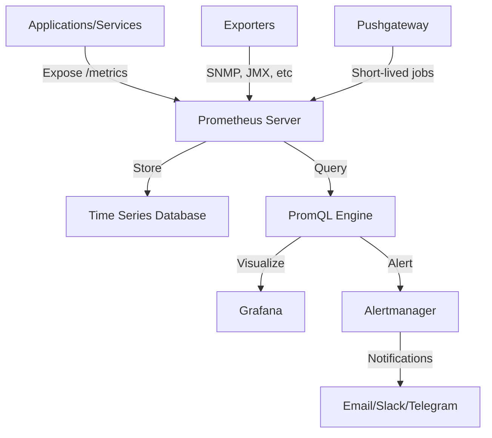
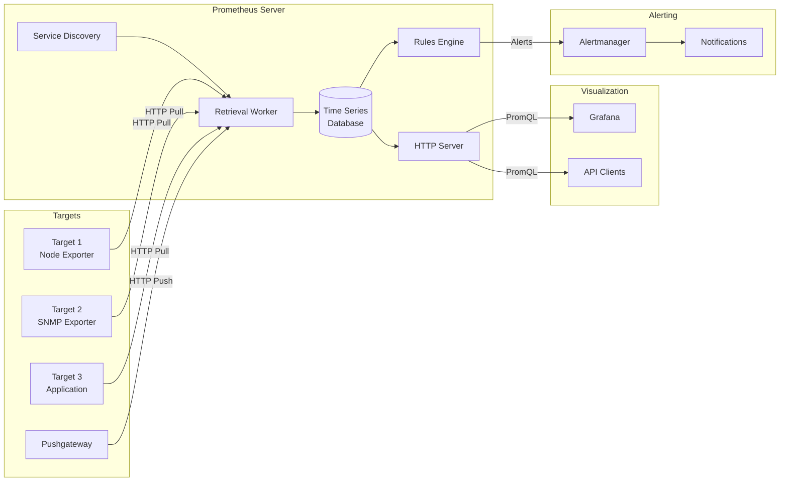
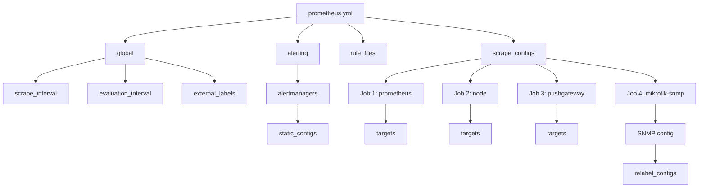
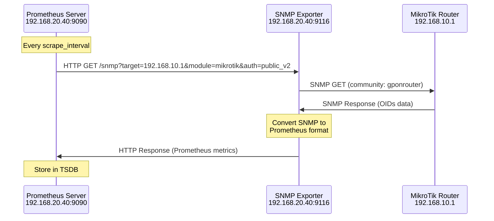
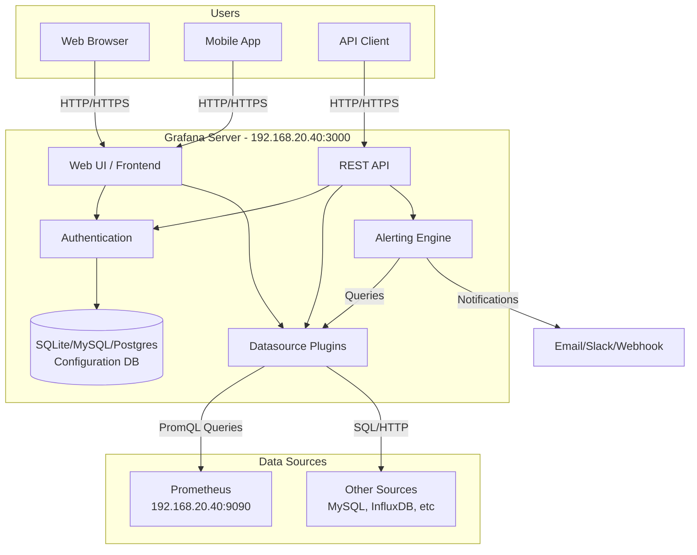
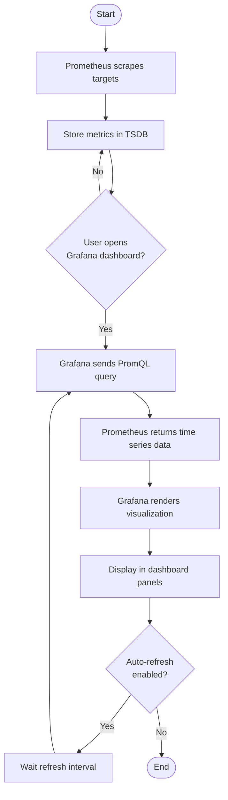
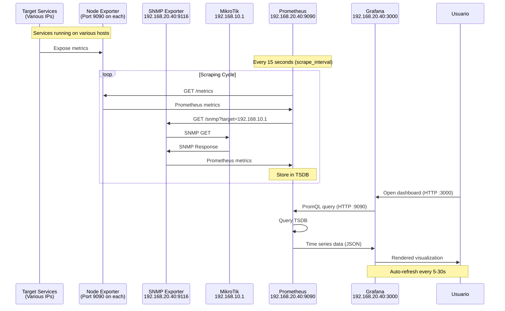
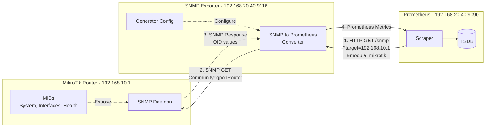

 # Infraestructura Red GPON - Prometheus y Grafana
---
## Introducción a Prometheus

**Prometheus** es un sistema de monitoreo y alertas de código abierto diseñado específicamente para la recopilación y almacenamiento de métricas en 
formato de series temporales.

### Características principales

- **Modelo de datos multidimensional**: Utiliza series temporales identificadas por nombre de métrica y pares clave-valor
- **Lenguaje de consulta potente**: PromQL (Prometheus Query Language) permite realizar consultas complejas y agregaciones
- **Arquitectura pull-based**: Prometheus extrae las métricas de los objetivos mediante HTTP
- **Almacenamiento local eficiente**: Base de datos de series temporales (TSDB) optimizada para alto rendimiento
- **Descubrimiento de servicios**: Soporte para descubrimiento dinámico de objetivos
- **Sin dependencias externas**: Funciona como binario único y autónomo



---

## Arquitectura de Prometheus



---

## Componentes del Sistema

### Prometheus Server

El servidor de Prometheus es el componente central del sistema de monitoreo. Está compuesto por tres subcomponentes principales:

#### 1. Data Retrieval Worker (Recopilador de Datos)

- **Función**: Extrae métricas de los objetivos configurados mediante solicitudes HTTP
- **Endpoint**: Típicamente `/metrics`
- **Frecuencia**: Configurable mediante `scrape_interval` (por defecto 1 minuto)
- **Protocolo**: HTTP/HTTPS con autenticación opcional

#### 2. Time Series Database (TSDB)

- **Almacenamiento**: Base de datos optimizada para series temporales
- **Formato**: Métricas con marcas de tiempo y etiquetas
- **Retención**: Configurable según necesidades (por defecto 15 días)
- **Compresión**: Algoritmos eficientes para minimizar espacio en disco
- **Ubicación**: Almacenamiento local en disco

#### 3. HTTP Server

- **API REST**: Expone endpoint para consultas PromQL
- **Puerto**: 9090 (por defecto)
- **Interfaz web**: Consola de expresiones y explorador de métricas
- **Endpoints**:
  - `/api/v1/query`: Consultas instantáneas
  - `/api/v1/query_range`: Consultas de rango temporal
  - `/metrics`: Métricas del propio Prometheus

### Exporters

Los exporters son componentes que exponen métricas de sistemas que no tienen instrumentación nativa de Prometheus.

#### Tipos de Exporters

1. **Node Exporter**: Métricas del sistema operativo (CPU, memoria, disco, red)
2. **SNMP Exporter**: Convierte métricas SNMP a formato Prometheus
3. **Blackbox Exporter**: Pruebas de sondeo (HTTP, DNS, TCP, ICMP)
4. **Custom Exporters**: Para aplicaciones específicas

### Pushgateway

- **Propósito**: Permite que trabajos de corta duración (batch jobs) envíen métricas
- **Uso**: Jobs que no viven lo suficiente para ser scrapeados
- **Patrón**: Push en lugar de pull
- **Puerto**: 9091 (por defecto)

### Alertmanager

- **Función**: Gestiona alertas generadas por Prometheus
- **Características**:
  - Agrupación de alertas relacionadas
  - Deduplicación de alertas repetidas
  - Silenciamiento temporal
  - Enrutamiento a diferentes receptores
  - Inhibición de alertas dependientes
- **Puerto**: 9093 (por defecto)

### Service Discovery

Permite el descubrimiento dinámico de objetivos de monitoreo:

- **Kubernetes**: Descubrimiento automático de pods y servicios
- **Consul**: Integración con Consul para service discovery
- **DNS**: Descubrimiento basado en registros DNS
- **Static**: Configuración manual de objetivos (usado en este proyecto)
- **File-based**: Archivos JSON/YAML con lista de objetivos

---

## Configuración de Prometheus

El archivo `prometheus.yml` es el archivo de configuración principal de Prometheus. Define cómo y qué monitorear.

### Estructura del archivo de configuración



### Secciones principales

#### 1. Global

Define configuraciones globales aplicables a todo el servidor:

- **scrape_interval**: Frecuencia de recopilación de métricas (15 segundos en este proyecto)
- **evaluation_interval**: Frecuencia de evaluación de reglas de alerta (15 segundos)
- **scrape_timeout**: Tiempo máximo de espera para una solicitud de scraping (10 segundos por defecto)
- **external_labels**: Etiquetas añadidas a todas las métricas exportadas

#### 2. Alerting

Configuración del Alertmanager:

- **alertmanagers**: Lista de instancias de Alertmanager
- **static_configs**: Configuración estática de targets
- En este proyecto: `localhost:9093`

#### 3. Rule Files

Archivos que contienen reglas de alertas y reglas de grabación:

- **Alerting rules**: Definen condiciones para generar alertas
- **Recording rules**: Pre-calculan expresiones frecuentes para mejorar rendimiento

#### 4. Scrape Configs

Define los trabajos de scraping y sus objetivos.

### Jobs configurados en el proyecto

#### Job 1: Prometheus (Auto-monitoreo)

```yaml
job_name: 'prometheus'
scrape_interval: 5s
scrape_timeout: 5s
static_configs:
  - targets: ['localhost:9090']
```

**Propósito**: Monitorea las métricas del propio servidor Prometheus.

#### Job 2: Node

```yaml
job_name: node
static_configs:
  - targets: 
    - localhost:9090
    - 192.168.20.20:9090  # BIND9 Primary
    - 192.168.20.2:9090   # Kea DHCP
    - localhost:9091      # Pushgateway
    - localhost:8000      # LibreNMS
    - 192.168.40.50:9090  # Dovecot/Postfix
    - 192.168.20.50:9090  # LibreQoS
    - 192.168.20.60:9090  # Chrony NTP
    - 192.168.50.20:9090  # Caddy Reverse Proxy
    - 192.168.50.10:9090  # Caddy Web 1
    - 192.168.50.11:9090  # Caddy Web 2
    - 192.168.20.21:9090  # BIND9 Secondary
```

**Propósito**: Monitorea múltiples servicios de la infraestructura mediante node exporters.

#### Job 3: Pushgateway

```yaml
job_name: 'pushgateway'
scrape_interval: 300s
honor_labels: true
static_configs:
  - targets: ['localhost:9091']
```

**Propósito**: Recopila métricas de trabajos batch o scripts de corta duración.

- **scrape_interval**: 300 segundos (5 minutos)
- **honor_labels**: Respeta las etiquetas originales de las métricas pusheadas

#### Job 4: MikroTik SNMP

```yaml
job_name: 'mikrotik-snmp'
static_configs:
  - targets:
    - 192.168.10.1  # Router Interno MikroTik
metrics_path: /snmp
params:
  module: [mikrotik]
  auth: [public_v2]
relabel_configs:
  - source_labels: [__address__]
    target_label: __param_target
  - source_labels: [__param_target]
    target_label: instance
  - target_label: __address__
    replacement: 192.168.20.40:9116  # SNMP Exporter
```

**Propósito**: Monitorea router MikroTik mediante SNMP Exporter.

**Relabel Configs**: Configuraciones de re-etiquetado para SNMP:
1. Toma la dirección del target (MikroTik)
2. La establece como parámetro para el SNMP Exporter
3. Redirige la solicitud al SNMP Exporter en lugar del target original



---

## Introducción a Grafana

**Grafana** es una plataforma de código abierto para visualización y análisis de métricas. Permite crear dashboards interactivos y dinámicos que consumen datos de múltiples fuentes, incluyendo Prometheus.

### Características principales

- **Multi-datasource**: Soporta múltiples fuentes de datos simultáneamente
- **Dashboards interactivos**: Paneles altamente personalizables con variedad de visualizaciones
- **Alerting**: Sistema de alertas integrado con múltiples canales de notificación
- **Templating**: Variables para crear dashboards dinámicos y reutilizables
- **Plugins**: Ecosistema extenso de plugins para paneles y datasources
- **Control de acceso**: Gestión de usuarios, equipos y permisos
- **API REST**: Integración programática para automatización

### Tipos de visualizaciones

1. **Graph/Time series**: Gráficos de líneas y áreas temporales
2. **Gauge**: Medidores circulares o lineales para valores instantáneos
3. **Stat**: Valores numéricos grandes con umbrales de color
4. **Table**: Tablas con datos tabulares
5. **Bar gauge**: Barras horizontales o verticales
6. **Heatmap**: Mapas de calor para distribuciones
7. **Pie chart**: Gráficos circulares para proporciones
8. **Alert list**: Lista de alertas activas

### Arquitectura de Grafana



---

## Integración Prometheus-Grafana

La integración entre Prometheus y Grafana proporciona una solución completa de monitoreo: Prometheus recopila y almacena métricas, mientras Grafana las visualiza de manera intuitiva.

### Flujo de trabajo de monitoreo



### Configuración de datasource

Para conectar Grafana con Prometheus:

1. **Acceder a Configuration → Data Sources**
2. **Add data source → Prometheus**
3. **Configurar parámetros**:
   - **Name**: Prometheus
   - **URL**: `http://192.168.20.40:9090` (o `http://localhost:9090` si están en el mismo host)
   - **Access**: Server (Grafana hace la petición) o Browser (el navegador hace la petición)
   - **Scrape interval**: 15s (debe coincidir con Prometheus)
4. **Test connection**: Verificar conectividad
5. **Save & Test**

### Consultas PromQL en Grafana

Grafana utiliza PromQL para consultar métricas de Prometheus. Ejemplos comunes:

#### CPU Usage
```promql
100 - (avg by (instance) (rate(node_cpu_seconds_total{mode="idle"}[5m])) * 100)
```

#### Memory Usage
```promql
(node_memory_MemTotal_bytes - node_memory_MemAvailable_bytes) / node_memory_MemTotal_bytes * 100
```

#### Network Traffic (Bytes In)
```promql
rate(ifHCInOctets[5m]) * 8
```

#### SNMP Temperature (MikroTik)
```promql
temperature{job="mikrotik-snmp"}
```

### Creación de dashboards

Los dashboards en Grafana se organizan en:

1. **Dashboard**: Contenedor principal
2. **Rows**: Filas para organizar paneles (opcional)
3. **Panels**: Visualizaciones individuales
4. **Variables**: Parámetros dinámicos para filtrado

---

## Implementación en el Proyecto

En este proyecto, Prometheus y Grafana están desplegados en el mismo servidor con IP **192.168.20.40**.

### Targets monitorizados

| Target | IP:Puerto | Servicio | Descripción |
|--------|-----------|----------|-------------|
| Prometheus | localhost:9090 | Prometheus Server | Auto-monitoreo |
| BIND9 Primary | 192.168.20.20:9090 | DNS | Servidor DNS primario |
| BIND9 Secondary | 192.168.20.21:9090 | DNS | Servidor DNS secundario |
| Kea DHCP | 192.168.20.2:9090 | DHCP | Servidor DHCP |
| Chrony NTP | 192.168.20.60:9090 | NTP | Servidor de tiempo |
| LibreQoS | 192.168.20.50:9090 | QoS | Gestión de calidad de servicio |
| Dovecot/Postfix | 192.168.40.50:9090 | Mail | Servidores de correo |
| Caddy Reverse Proxy | 192.168.50.20:9090 | Reverse Proxy | Proxy inverso |
| Caddy Web 1 | 192.168.50.10:9090 | Web Server | Servidor web 1 |
| Caddy Web 2 | 192.168.50.11:9090 | Web Server | Servidor web 2 |
| LibreNMS | localhost:8000 | Monitoring | Sistema de monitoreo de red |
| MikroTik Router | 192.168.10.1 (via SNMP) | Router | Router interno |

### Configuración de acceso

#### Prometheus

- **URL interna**: `http://192.168.20.40:9090`
- **URL localhost**: `http://localhost:9090`
- **Protocolo**: HTTP
- **Autenticación**: No configurada (red interna)

#### Grafana

- **URL interna**: `http://192.168.20.40:3000`
- **Protocolo**: HTTP
- **Binding**: Configurado para aceptar conexiones no-localhost
- **Autenticación**: Usuario/contraseña (configurado durante instalación)
- **Usuario predeterminado**: admin

### Estructura de dashboards


### Flujo de datos completo



---

## Monitoreo SNMP de MikroTik

El monitoreo del router MikroTik se realiza mediante SNMP (Simple Network Management Protocol), utilizando el SNMP Exporter de Prometheus.

### Arquitectura SNMP



### Configuración SNMP del MikroTik

En el router MikroTik debe estar habilitado SNMP con la comunidad configurada:

```
/snmp
set enabled=yes
set contact="admin@gpon.local"
set location="Network Core"

/snmp community
set [ find default=yes ] name=gponrouter
```

### OIDs monitorizados

La configuración SNMP del proyecto monitoriza los siguientes OIDs:

#### System OIDs

| OID | Nombre | Descripción | Tipo |
|-----|--------|-------------|------|
| 1.3.6.1.2.1.1.5.0 | identity | Nombre del equipo | DisplayString |
| 1.3.6.1.4.1.14988.1.1.3.100.1.3.17 | temperature | Temperatura del equipo | Gauge |

#### Interface OIDs

| OID | Nombre | Descripción | Tipo |
|-----|--------|-------------|------|
| 1.3.6.1.2.1.2.2.1.2.1 | ifaceName | Nombre de la interfaz | DisplayString |
| 1.3.6.1.2.1.31.1.1.1.6.1 | bytesIn | Bytes recibidos en interfaz | Gauge |
| 1.3.6.1.2.1.31.1.1.1.10.1 | bytesOut | Bytes enviados en interfaz | Gauge |

### Métricas generadas

El SNMP Exporter convierte los OIDs SNMP a métricas Prometheus:

```promql
# Temperatura del router
temperature{instance="192.168.10.1", job="mikrotik-snmp"}

# Nombre de la interfaz
ifaceName{instance="192.168.10.1", job="mikrotik-snmp"}

# Bytes entrantes (tasa)
rate(bytesIn{instance="192.168.10.1"}[5m])

# Bytes salientes (tasa)
rate(bytesOut{instance="192.168.10.1"}[5m])
```

### Visualización en Grafana

Para visualizar métricas del MikroTik en Grafana:

1. **Panel de temperatura**:
   - Tipo: Gauge
   - Query: `temperature{job="mikrotik-snmp"}`
   - Umbral: Verde (<70°C), Amarillo (70-80°C), Rojo (>80°C)

2. **Panel de tráfico de red**:
   - Tipo: Graph (Time series)
   - Query In: `rate(bytesIn{job="mikrotik-snmp"}[5m]) * 8` (convertir a bits/s)
   - Query Out: `rate(bytesOut{job="mikrotik-snmp"}[5m]) * 8`
   - Unidad: bps (bits per second)

3. **Panel de identidad**:
   - Tipo: Stat
   - Query: `identity{job="mikrotik-snmp"}`

