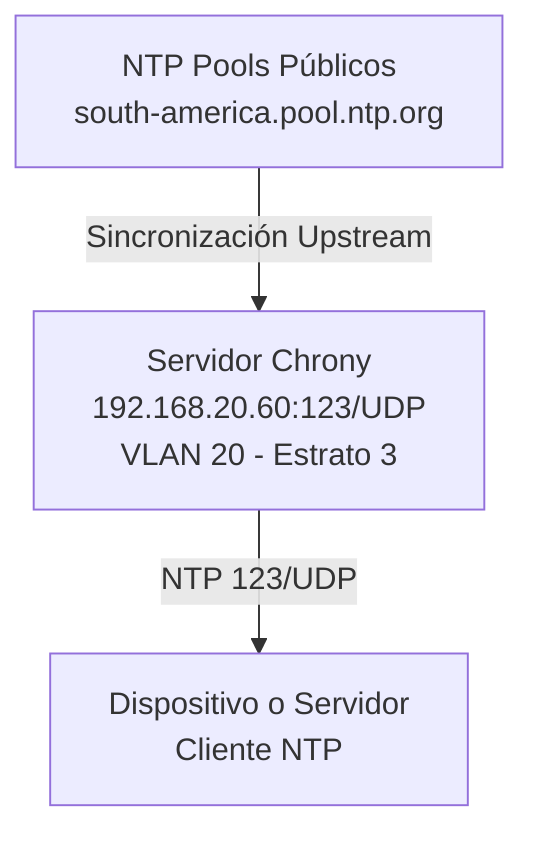

# Infraestructura Red GPON - SERVICIO NTP
## Implementación NTP con Chrony
---

## Introducción al Servicio NTP

### Definición

Según la documentación oficial de Red Hat, el Protocolo de Tiempo de Red (NTP - Network Time Protocol) es un protocolo que **permite la difusión precisa de información de tiempo y fecha para mantener los relojes del sistema en computadoras conectadas en red sincronizadas a una referencia común sobre la red o Internet**.

NTP es implementado en sistemas Linux mediante un demonio que se ejecuta en espacio de usuario. En Ubuntu Server 24.04 y Red Hat Enterprise Linux, el demonio predeterminado es `chronyd`, que actúa tanto como cliente como servidor NTP.

## Conceptos Fundamentales

### Estratos NTP

NTP utiliza una jerarquía de estratos que define la confiabilidad y precisión de las fuentes de tiempo:

| Estrato | Origen | Descripción |
|---------|--------|-------------|
| 0 | Reloj de Referencia | GPS, radio atómica, relojes atómicos |
| 1 | Servidores Primarios | Conectados directamente a reloj de referencia |
| 2 | Servidores Secundarios | Sincronizados con estrato 1 |
| 3-15 | Servidores en Cascada | Sincronizados con estratos superiores |
| 16 | Desincronizado | Servidor no sincronizado |

El servidor Chrony implementado es **Estrato 3**, sincronizado desde pools públicos de estrato 1 y 2.

### Pools NTP

Los pools NTP son conjuntos de servidores públicos que proporcionan sincronización de tiempo de forma gratuita. Para Latinoamérica, se utilizan:

- `0.south-america.pool.ntp.org` - Pool primario Sudamérica
- `1.south-america.pool.ntp.org` - Pool secundario Sudamérica
- `2.co.pool.ntp.org` - Pool Colombia

Cada dirección representa múltiples servidores físicos que rotan automáticamente, para la disponibilidad y redundancia.


## Arquitectura del Servicio NTP



## Instalación de Chrony


### Pasos de Instalación

Actualizar índice de repositorios:

```bash
sudo apt update
```

Instalar paquete Chrony:

```bash
sudo apt install chrony -y
```

Verificar versión instalada:

```bash
chrony --version
```

Verificar que el servicio está activo:

```bash
sudo systemctl status chrony
```

Habilitar autoarranque al iniciar el sistema:

```bash
sudo systemctl enable chrony
```

## Configuración del Servidor NTP

### Configuración de Red - Netplan

El archivo de configuración de red define la dirección IP estática y parámetros de conectividad.

Crear o editar el archivo de configuración:

```bash
sudo nano /etc/netplan/00-installer-config.yaml
```

Contenido del archivo `00-installer-config.yaml`:

```yaml
network:
  version: 2
  renderer: networkd

  ethernets:
    enp0s3:
      dhcpv4: no
      addresses:
        - 192.168.20.60/24

      routes:
        - to: default
          via: 192.168.20.1

      nameservers:
        addresses:
          - 192.168.20.20
```

Aplicar y validar configuración:

```bash
sudo netplan apply
sudo netplan validate
```

Verificar configuración aplicada:

```bash
ip addr show dev enp0s3
ip route show
```

### Configuración de Chrony

El archivo `chrony.conf` contiene la configuración del servidor NTP y define:
- Servidores NTP para los upstream pools
- Control de acceso desde clientes
- Parámetros de sincronización
- Logging y diagnósticos

Editar el archivo de configuración:

```bash
sudo nano /etc/chrony/chrony.conf
```

Contenido del archivo `chrony.conf`:

```conf

```

Aplicar cambios de configuración:

```bash
sudo systemctl restart chrony
sudo systemctl is-active chrony
```

Ver logs en tiempo real:

```bash
sudo journalctl -u chrony -f
```

## Configuración de Red y Firewall

### Firewall UFW

Permitir acceso NTP desde cada VLAN autorizada:

```bash
# Permitir desde VLAN X 
sudo ufw allow from 192.168.x.0/24 to any port 123 proto udp

# Recargar reglas
sudo ufw reload

# Verificar reglas
sudo ufw status numbered
```

### Validación de Conectividad

Verificar que Chrony escucha en puerto 123:

```bash
sudo ss -ulnp | grep chrony
```

Salida esperada:
```
UNCONN 0 0 0.0.0.0:123 0.0.0.0:* users:(("chronyd",pid=XXXX,fd=XX))
```

Verificar fuentes NTP:

```bash
chronyc sources
```

Verificar sincronización:

```bash
chronyc tracking
```

## Configuración de Clientes NTP

### Máquinas Virtuales Ubuntu (DNS, DHCP, Web, Proxy)

En cada VM cliente, editar archivo de configuración de timesyncd:

```bash
sudo nano /etc/systemd/timesyncd.conf
```

Contenido del archivo `timesyncd.conf`:

```conf
[Time]
# Servidor NTP primario - Chrony local
NTP=192.168.20.60

# Servidores alternativos para fallback
FallbackNTP=0.south-america.pool.ntp.org 1.south-america.pool.ntp.org
```

Aplicar cambios:

```bash
sudo systemctl restart systemd-timesyncd
sudo systemctl enable systemd-timesyncd
timedatectl timesync-status
```

### Router MikroTik Interno (CCR2004)

Configurar cliente NTP mediante CLI:

```bash
/system ntp client
set enabled=yes primary-ntp=192.168.20.60 secondary-ntp=pool.ntp.org

# Verificar
print
```

### Switch Cisco SG350X-24

Configurar SNTP mediante CLI:

```cisco
configure terminal
sntp server 192.168.20.60 poll
sntp unicast client enable
clock timezone GMT-5
exit
write memory
show sntp status
show clock
```

### OLT Huawei EA5800-X2

Acceder a interfaz CLI o web de la OLT y configurar:

```bash
system-view
ntp-service unicast-server 192.168.20.60 poll 6
commit
quit
```

## Verificación del Servicio

### Desde el Servidor Chrony

Ver estado de fuentes NTP:

```bash
chronyc sources -v
```

Ver estadísticas de fuentes:

```bash
chronyc sourcestats
```

Ver información de sincronización:

```bash
chronyc tracking
```

Ver clientes conectados:

```bash
sudo chronyc clients
```

### Desde Clientes Linux

Probar conectividad al servidor:

```bash
ntpdate -q 192.168.20.60
timedatectl
```

### Monitoreo Continuo

Ver logs de mediciones:

```bash
sudo tail -f /var/log/chrony/measurements.log
```

Ver logs de estadísticas:

```bash
sudo tail -f /var/log/chrony/statistics.log
```

Ver journal del sistema:

```bash
sudo journalctl -u chrony -n 50 -f
```

## Tabla de Referencia Rápida

### Puertos y Protocolos

| Servicio | Puerto | Protocolo | Dirección | Propósito |
|----------|--------|-----------|-----------|-----------|
| NTP | 123 | UDP | Bidireccional | Sincronización de tiempo |
| NTP | 123 | TCP | Fallback | Sincronización alternativa |
