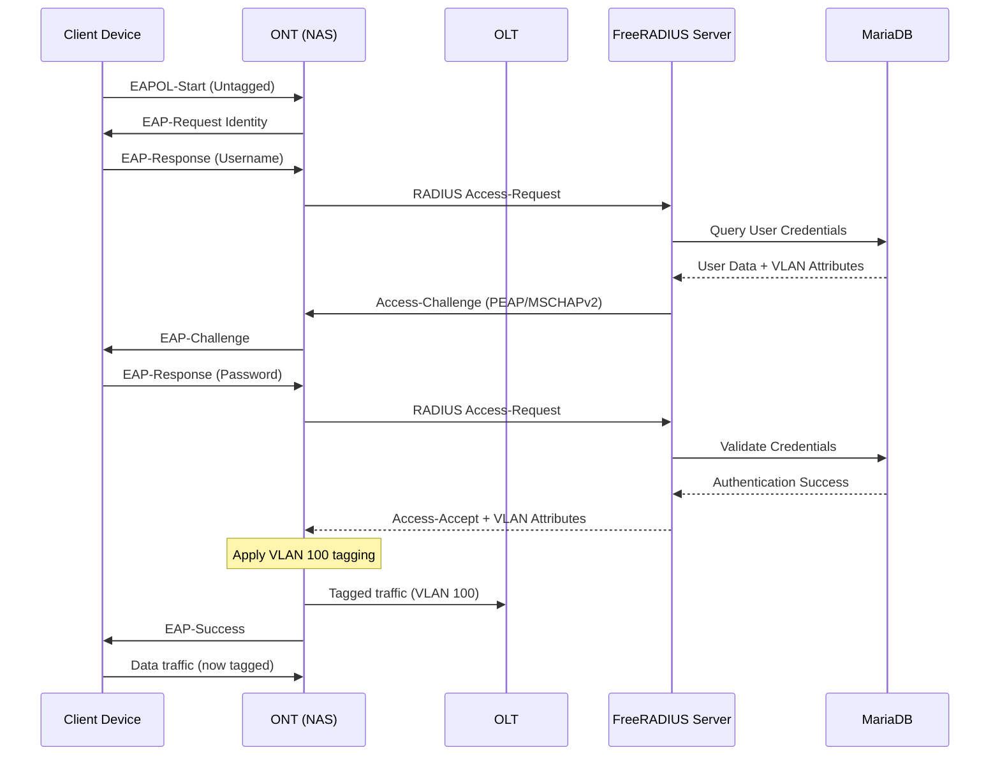
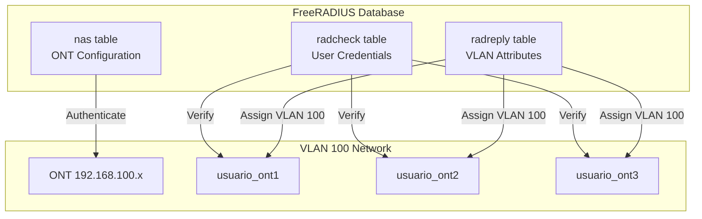
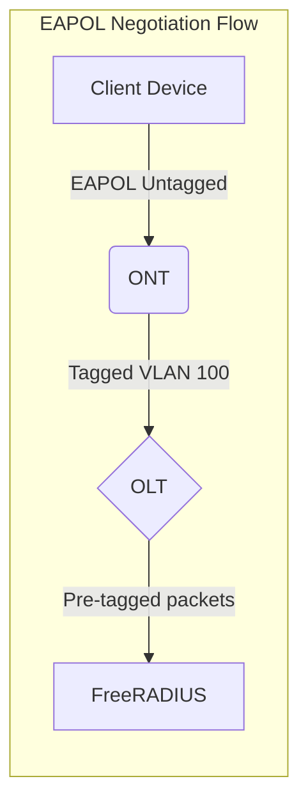

# Documentación de FreeRADIUS - Autenticación 802.1X con Asignación Dinámica de VLAN

## Introducción al Servicio

FreeRADIUS es un servidor de autenticación AAA (Authentication, Authorization, and Accounting) que permite implementar autenticación 802.1X con asignación dinámica de VLANs. 
En este proyecto GPON, el objetivo es autenticar usuarios conectados a través de ONTs y asignarles dinámicamente la VLAN 100 una vez completada la autenticación, evitando el etiquetado prematuro de paquetes.

El flujo de autenticación permite que los dispositivos cliente se conecten sin VLAN preconfigurada, y solo después de validar sus credenciales, el servidor RADIUS instruye a la OLT/ONT para etiquetar el tráfico en la VLAN correspondiente.

### Flujo de Autenticación 802.1X



## Instalación y Configuración

### Paso 1: Instalación de Paquetes

Se instalan los componentes necesarios para FreeRADIUS con soporte MySQL y herramientas de gestión:

```bash
sudo apt update && sudo apt upgrade -y
sudo apt install freeradius freeradius-utils freeradius-mysql mariadb-server -y
```

### Paso 2: Configuración de Base de Datos MariaDB

Se habilita y asegura el servicio de base de datos:

```bash
sudo systemctl enable --now mariadb
sudo mysql_secure_installation
```

Configuración de seguridad aplicada:
- Set root password: Sí (contraseña segura)
- Remove anonymous users: Sí
- Disallow root login remotely: Sí
- Remove test database: Sí
- Reload privilege tables: Sí

### Paso 3: Creación de Base de Datos RADIUS

Se crea la base de datos y usuario específico para FreeRADIUS:

```bash
sudo mysql -u root -p
```

```sql
CREATE DATABASE radius;
GRANT ALL PRIVILEGES ON radius.* TO 'radius'@'localhost' IDENTIFIED BY 'TuPasswordSeguro2024!';
FLUSH PRIVILEGES;
EXIT;
```

Importación del esquema de tablas:

```bash
sudo su -
mysql -u root -p radius < /etc/freeradius/3.0/mods-config/sql/main/mysql/schema.sql
exit
```

Verificación de tablas creadas:

```bash
sudo mysql -u root -p -e "USE radius; SHOW TABLES;"
```

### Paso 4: Habilitación del Módulo SQL

Se habilita el módulo SQL mediante enlace simbólico:

```bash
sudo ln -s /etc/freeradius/3.0/mods-available/sql /etc/freeradius/3.0/mods-enabled/
```

Configuración del módulo SQL en `/etc/freeradius/3.0/mods-available/sql`:

```
sql {
    dialect = "mysql"
    driver = "rlm_sql_${dialect}"

    # TLS deshabilitado para conexión local
    mysql {
        warnings = auto
    }

    # Configuración de conexión
    server = "localhost"
    port = 3306
    login = "radius"
    password = "TuPasswordSeguro2024!"

    # Base de datos
    radius_db = "radius"

    # Tablas estándar
    acct_table1 = "radacct"
    acct_table2 = "radacct"
    postauth_table = "radpostauth"
    authcheck_table = "radcheck"
    groupcheck_table = "radgroupcheck"
    authreply_table = "radreply"
    groupreply_table = "radgroupreply"
    usergroup_table = "radusergroup"

    delete_stale_sessions = yes

    # Pool de conexiones
    pool {
        start = ${thread[pool.start_servers}
        min = ${thread[pool.min_spare_servers}
        max = ${thread[pool.max_servers}
        spare = ${thread[pool.max_spare_servers}
        uses = 0
        retry_delay = 30
        lifetime = 0
        idle_timeout = 60
        max_retries = 5
    }

    # Leer clientes (NAS) desde base de datos
    read_clients = yes
    client_table = "nas"

    group_attribute = "SQL-Group"

    # Incluir queries específicas del dialecto
    $INCLUDE ${modconfdir}/${.:name}/main/${dialect}/queries.conf
}
```

Ajuste de permisos:

```bash
sudo chgrp -h freerad /etc/freeradius/3.0/mods-available/sql
sudo chown -R freerad:freerad /etc/freeradius/3.0/mods-enabled/sql
```

## Configuración para VLAN 100 (ONTs)

### Arquitectura de Asignación VLAN



### Paso 5: Registro de NAS (ONT)

Se registra cada ONT como Network Access Server (NAS) en la base de datos. El parámetro `secret` debe coincidir con la configuración del ONT:

```sql
INSERT INTO nas (nasname, shortname, type, secret, description) 
VALUES ('192.168.100.1', 'ont-huawei-001', 'other', 'secretONT2024!', 'Huawei EG8145V5 ONT VLAN 100 - Usuario 1');

INSERT INTO nas (nasname, shortname, type, secret, description) 
VALUES ('192.168.100.2', 'ont-huawei-002', 'other', 'secretONT2024!', 'Huawei EG8145V5 ONT VLAN 100 - Usuario 2');

INSERT INTO nas (nasname, shortname, type, secret, description) 
VALUES ('192.168.100.3', 'ont-huawei-003', 'other', 'secretONT2024!', 'Huawei EG8145V5 ONT VLAN 100 - Usuario 3');
```

### Paso 6: Creación de Usuarios para VLAN 100

Se crean usuarios con credenciales y atributos VLAN. Los atributos críticos son:
- **Tunnel-Type**: Define el tipo de túnel como VLAN (valor 13)
- **Tunnel-Medium-Type**: Especifica el medio IEEE-802 (valor 6)
- **Tunnel-Private-Group-ID**: Indica el ID de VLAN a asignar (100)

```sql
-- Usuario 1 - VLAN 100
INSERT INTO radcheck (username, attribute, op, value) 
VALUES ('usuario_ont1', 'Cleartext-Password', ':=', 'pass_ont1_2024');

INSERT INTO radreply (username, attribute, op, value) 
VALUES 
('usuario_ont1', 'Tunnel-Type', ':=', 'VLAN'),
('usuario_ont1', 'Tunnel-Medium-Type', ':=', 'IEEE-802'),
('usuario_ont1', 'Tunnel-Private-Group-ID', ':=', '100');

-- Usuario 2 - VLAN 100
INSERT INTO radcheck (username, attribute, op, value) 
VALUES ('usuario_ont2', 'Cleartext-Password', ':=', 'pass_ont2_2024');

INSERT INTO radreply (username, attribute, op, value) 
VALUES 
('usuario_ont2', 'Tunnel-Type', ':=', 'VLAN'),
('usuario_ont2', 'Tunnel-Medium-Type', ':=', 'IEEE-802'),
('usuario_ont2', 'Tunnel-Private-Group-ID', ':=', '100');

-- Usuario 3 - VLAN 100
INSERT INTO radcheck (username, attribute, op, value) 
VALUES ('usuario_ont3', 'Cleartext-Password', ':=', 'pass_ont3_2024');

INSERT INTO radreply (username, attribute, op, value) 
VALUES 
('usuario_ont3', 'Tunnel-Type', ':=', 'VLAN'),
('usuario_ont3', 'Tunnel-Medium-Type', ':=', 'IEEE-802'),
('usuario_ont3', 'Tunnel-Private-Group-ID', ':=', '100');
```

### Paso 7: Configuración EAP (PEAP)

Se configura el método de autenticación EAP en `/etc/freeradius/3.0/mods-enabled/eap`:

```
eap {
    default_eap_type = peap
    timer_expire = 60
    ignore_unknown_eap_types = no
    cisco_accounting_username_bug = no
    max_sessions = ${max_requests}

    # PEAP (Protected EAP)
    peap {
        default_eap_type = mschapv2
        copy_request_to_tunnel = no
        use_tunneled_reply = yes
    }
}
```

### Paso 8: Generación de Certificados

Se generan los certificados SSL/TLS necesarios para PEAP:

```bash
sudo su -
cd /etc/freeradius/3.0/certs
make
exit
```

### Paso 9: Reinicio del Servicio

```bash
sudo systemctl restart freeradius
sudo systemctl status freeradius
```

## Problema Identificado y Solución

### Problema: Etiquetado Prematuro de VLAN

Durante la implementación inicial, se configuró la OLT para etiquetar paquetes en VLAN 100 desde el inicio, antes de la autenticación 802.1X. 
Esto causaba conflictos en el flujo de autenticación, ya que los paquetes EAPOL (Extensible Authentication Protocol over LAN) deben circular sin etiquetar durante la fase de autenticación.



### Solución

La solución consiste en reestructurar la configuración de la OLT y ONT para permitir tráfico sin etiquetar durante la autenticación:

1. **Configuración de Puerto en OLT**: El puerto PON debe configurarse en modo híbrido o trunk, permitiendo tanto tráfico etiquetado como sin etiquetar.

2. **Configuración de ONT**: La ONT debe configurarse para:
   - Aceptar tráfico EAPOL sin etiquetar en el puerto WAN
   - Transmitir paquetes EAPOL hacia FreeRADIUS sin VLAN
   - Aplicar etiquetado VLAN 100 solo después de recibir Access-Accept con los atributos Tunnel-*

3. **Asignación Dinámica**: FreeRADIUS responde con los atributos VLAN en el mensaje Access-Accept, y la ONT aplica dinámicamente la VLAN 100 al puerto autenticado.

### Configuración de ONT para Autenticación Dinámica

En el Huawei EG8145V5, se debe configurar:

**Modo de autenticación**: 802.1X en puerto WAN o SSID Wi-Fi  
**Servidor RADIUS**: Dirección IP del servidor FreeRADIUS  
**Shared Secret**: Debe coincidir con el valor en tabla `nas`  
**VLAN Mode**: Dynamic / RADIUS-Assigned  

Comandos típicos en OLT EA5800-X2:

```
interface gpon 0/1
  ont 1 type EG8145V5 sn HWTC12345678

service-port vlan 100 gpon 0/1/1 gemport 1 multi-service user-vlan 100

ont-lineprofile gpon profile-id 10
  tcont 4 dba-type-id 10
  gem mapping 1 4 vlan 100

ont-srvprofile gpon profile-id 20
  ont-port eth 1 vlan-mode tag vlan 100
  security-mgmt 802.1x enable
  radius-server primary ip <IP_FREERADIUS> shared-key secretONT2024!
```
